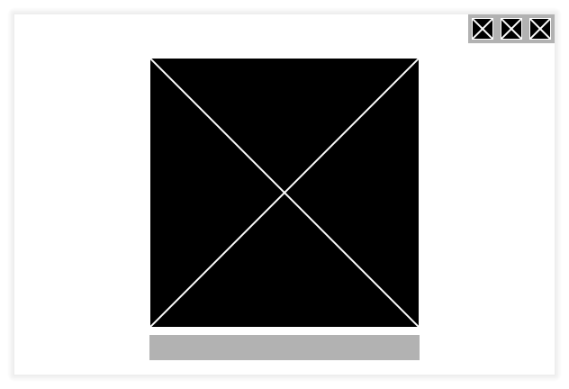

# Dfenestration

A general cross-platform desktop GUI toolkit in D, inspired of the GTK+ 2 philosophy.

"Why this old philosophy instead of something more modern?" you might say.

Because there are already a lot of modern toolkits in trendy programming languages.

Whereas traditional frameworks are becoming rarer, and harder to use with the time.

My answer is to make a framework with a somewhat old architecture. Surely not optimal 
but good enough and easy to use.


## Example code

```d
import dfenestration.widgets.aligner;
import dfenestration.widgets.button;
import dfenestration.widgets.column;
import dfenestration.widgets.test;
import dfenestration.widgets.text;
import dfenestration.widgets.window;
import dfenestration.primitives;

int main() 
    => new Window()
            .title("Dfenestration example")
        [
            new Aligner()
            [
                new Column()
                    .spacing(8)
                [
                    new Test()
                        .size(Size(200, 200))
                        .naturalSize(Size(300, 300)),

                    new class Button { override void onPress(Point, MouseButton) { info("Click registered!"); } }
                    [
                        new Text("Hello!!")
                    ]
                ]
            ],
        ].run();
```

Screenshot of that example (as of 2024-07-31, Wayland without server decorations + OpenGL):



## Goals

_and explaining my design choices_

An all-purpose GUI framework written in D. Like GTK or Qt. \
But not an application framework.

To be more precise, I distinguish the GUI part from the app part.

The GUI is making buttons, sliders, on a window. At the edge of that feature set you 
have multimedia use (that will be implemented in order to have a video widget), and
some system-specific stuff such as file picking dialogs. Those would probably be more
suited for a separate library, that could be re-used across different GUI toolkits (I 
may make that library too).

Application stuff like IPC, app instance management, command line handling is ignored
here, and hopefully someone else will tackle that in another library (again, if no one
wants to make a separate library, I may do that).

Some choices have been made in that sense:
- Using as much library written in D as possible.
- ...although text is rendered with FreeType and Harfbuzz, and Fribidi is used. I am not
an expert in every language of this world, so using the standard is better here. 
- Accessibility should work correctly at the end. This may imply using access-kit
to ensure a correct support for every platform.

> Why not modularizing the backend part from the widget part? It would allow re-use
> in other projects.

I want to do that. I think that would be better. But for now everything is integrated
because splitting everything from the start is unpractical for development.

## WIP

- bug, windows are not appearing.
- Font shaping
- Pop-up support/multiple windows. xdg-toplevel-drag.
- click, touch, scroll, gestures!
- focus management (nextFocus, previousFocus), accels
- fractional scaling

## Known bugs

#### _Vulkan backend is bad_

- Resizing from the top left corner with the Vulkan backend is making the window jump 
the first time.
- Resizing a vulkan window is a bit laggy (it's a VkVG issue tho).
- Vulkan + Wayland + Nvidia is buggy.

## Current support

Wayland with relatively recent protocols.

## Roadmap

- Platform support

  |                            | Software | OpenGL    | Vulkan | Metal |
  |----------------------------|----------|-----------|--------|-------|
  | Wayland (xdg-shell + DLCs) |          | OK (EGL)  | wip    | -     |
  | X11 (xcb)                  |          | wip (EGL) | wip    | -     |
  | Windows                    |          |           |        | -     |
  | macOS                      |          | maybe     | maybe  |       |

For now, support for other platforms is not planned. I used xdg-shell for Wayland as
it is now the standard. Don't be surprised if some of the things GTK+ 3 is doing are
different in dfenestration (GTK+ 3 used wl-shell-surface).

- Accessibility
  - [ ] Access-kit
  - [ ] AT-SPI (Linux)
  - [ ] Windows
  - [ ] macOS

Wayland is the first to be supported since it's the most barebones one. By taking care of
it first the toolkit won't make any assumption about any feature support in the
implementation.

Priority:

- Platform support: Wayland support (Software and OpenGL) with xdg-decorations support
- Button and text widgets
- Styling?
- Platform support: X11 support (with any renderer)
- Making a TextLine widget
- Making a ScrollView widget
- Accessibility: AT-SPI
- Fractional scaling on Wayland
- Platform support: Windows (with any renderer)
- Accessibility: Windows
- Theming (theme engines, affecting defaults and draws)
- Example: Port a complex widget from GTK+ 2
- **Stabilise API**
- Platform support: macOS (Software)
- Accessibility: macOS
- Blur effects on Windows, macOS and KDE

## Credits

- Name shamelessly stolen from fsckboy on Hacker News
- VkVG by Jean-Pierre Bruyère
- NanoVega by Adam D. Ruppe
